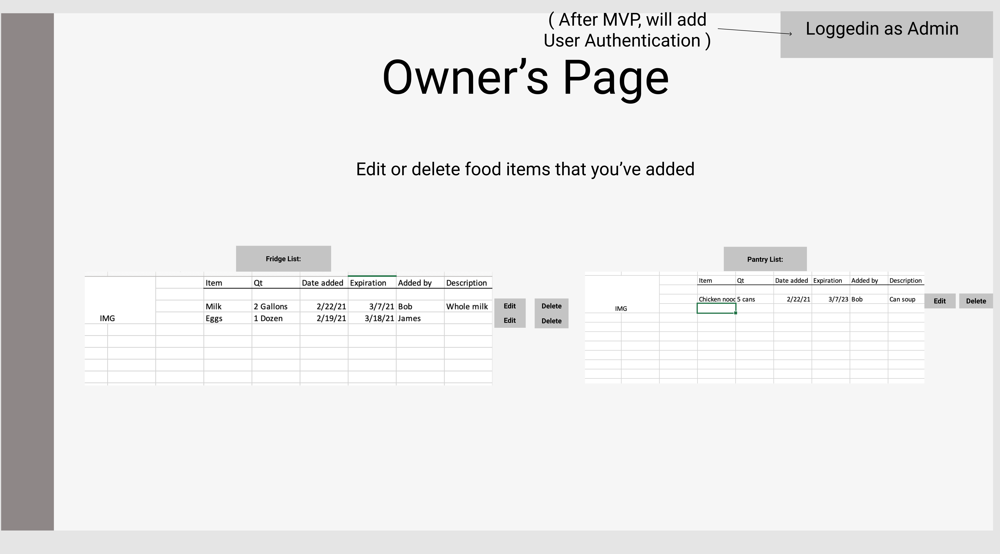
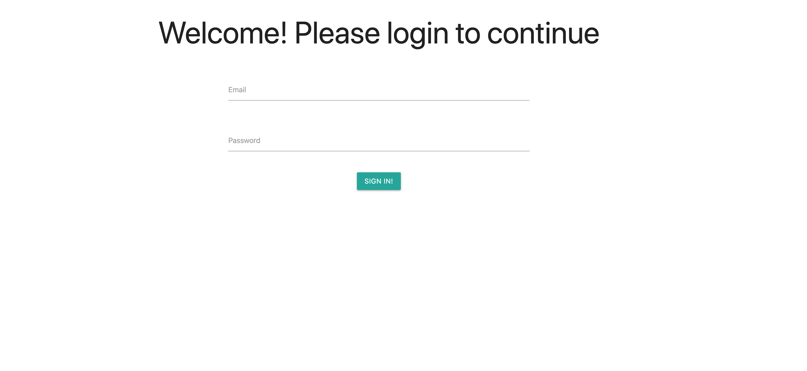

# Community-chest

---
 ## Description
  Community-Chest fridge's offer free food — from fresh produce to home-cooked meals — along with sanitary products and other health-related supplies to communities in need, no questions asked.
  
  
  Visit us at [Community-chest](https://community-chest134.herokuapp.com/)     

---
  ## Table of Contents
- [Community-chest](#community-chest)
	- [Description](#description)
	- [Table of Contents](#table-of-contents)
	- [Wireframe](#wireframe)
	- [ERD](#erd)
	- [DEMO:](#demo)
	- [Preview:](#preview)
	- [Installation](#installation)
	- [License](#license)
	- [Contributions](#contributions)

  
---
## Wireframe 

---
## ERD 

---
## DEMO:

## Preview: 

---
## Installation
 - Bring this repo to local machine. 
 - Run on Visual Studio Code and open a terminal. 
 - Once terminal is open, you will need run `npm install` in the terminal. 
 - Once installed, run "npm start". 
 - Then open a browser and test if the platform is functioning on "Localhost:3000". 
 
 Visit us at [Community-chest](https://community-chest134.herokuapp.com/)     .  
 Admin usage: 

 `Username: test@gmail.com`

 `Password: 12345`

---

## License  

Copyright 2021
Permission is hereby granted, free of charge, to any person obtaining a copy of this software and associated documentation files (the "Software"), to deal in the Software without restriction, including without limitation the rights to use, copy, modify, merge, publish, distribute, sublicense, and/or sell copies of the Software, and to permit persons to whom the Software is furnished to do so, subject to the following conditions:
The above copyright notice and this permission notice shall be included in all copies or substantial portions of the Software.
THE SOFTWARE IS PROVIDED "AS IS", WITHOUT WARRANTY OF ANY KIND, EXPRESS OR IMPLIED, INCLUDING BUT NOT LIMITED TO THE WARRANTIES OF MERCHANTABILITY, FITNESS FOR A PARTICULAR PURPOSE AND NONINFRINGEMENT. IN NO EVENT SHALL THE AUTHORS OR COPYRIGHT HOLDERS BE LIABLE FOR ANY CLAIM, DAMAGES OR OTHER LIABILITY, WHETHER IN AN ACTION OF CONTRACT, TORT OR OTHERWISE, ARISING FROM, OUT OF OR IN CONNECTION WITH THE SOFTWARE OR THE USE OR OTHER DEALINGS IN THE SOFTWARE.

---
## Contributions
Special thanks to Georgia Tech Boot-camp staff for the positive feedback and support. 

Production Team:

- [Andre Diop](https://github.com/AndreDiop)
- [Alsharif Eid](https://github.com/alsharifnahas)
- [Caleb Glorvigen](https://github.com/Glorvi23)
- [Sahil Patel](https://github.com/Spatel134)

---

Visit us at [Community-chest](https://community-chest134.herokuapp.com/)     ! 

 Admin usage: 

 `Username: test@gmail.com`

 `Password: 12345`

 *Please use Google Chrome browser*
